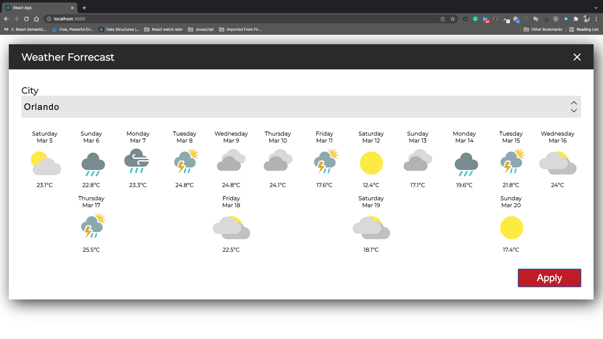

# Installation

Clone the repo and run the following command:

```
npm install
```

Once you have all the dependencies, be sure to add the API_KEY into the file called ***index.js*** you could find this file into the Constants folder.

Example:

```
//This const it's alredy on the file, you should only add the API_KEY
export const API_KEY = "your-api-key-here";
```


Then run ***npm start*** to start the project
### `npm start`

## Layout
;